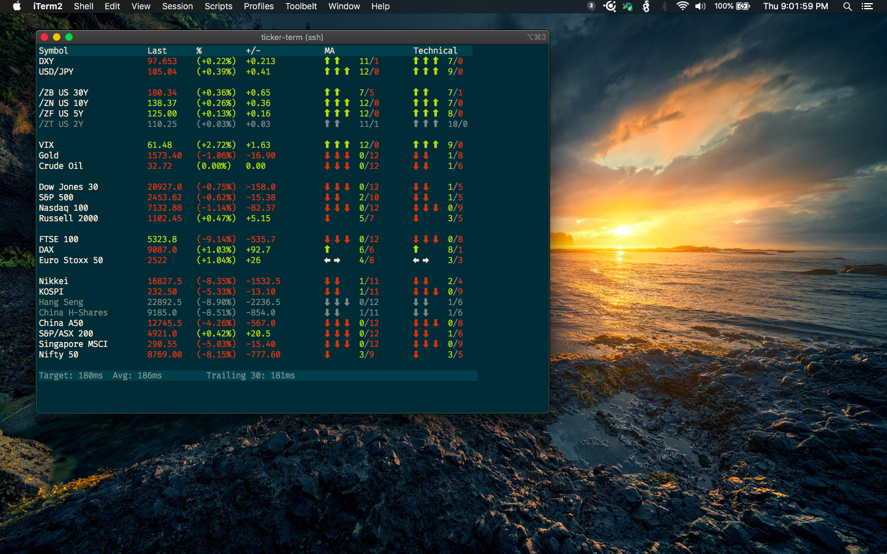
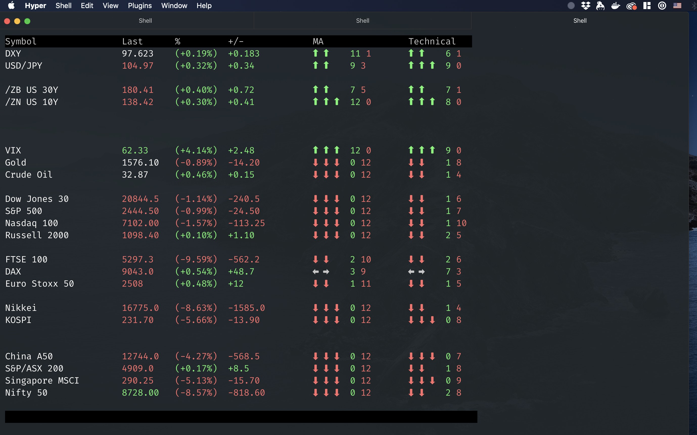

# ticker-term

Live futures quotes in your terminal.

## Requirements

Linux or macOS. It *might* work with [Windows 10's new bash shell](https://www.howtogeek.com/249966/how-to-install-and-use-the-linux-bash-shell-on-windows-10/).

go 1.14

## Installation

#### Option 1: Build from source (recommended)

1. [Install go for your platform](https://golang.org/dl/).

2. From a terminal, run `go get -u github.com/zpkg/ticker-term`

#### Option 2: Pre-compiled binary

Grab a binary for Linux or macOS on the releases page.

## Usage

`ticker-term`
