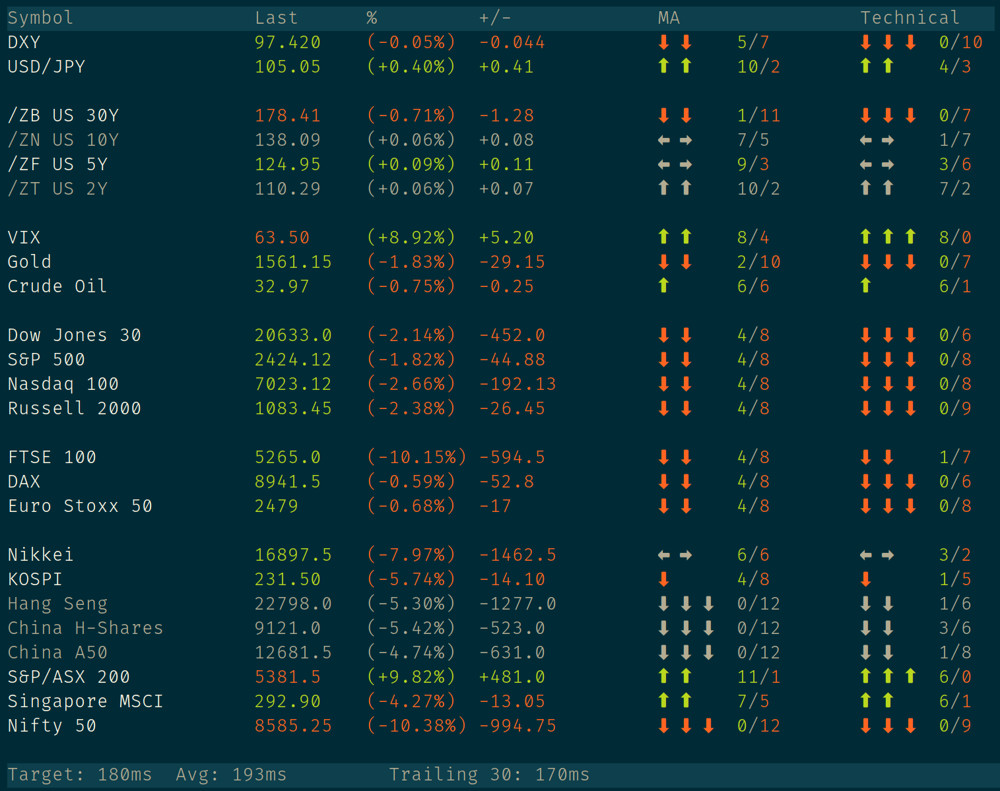

# ticker-term

Live futures quotes in your terminal.





## Requirements

Linux or macOS. It *might* work with [Windows 10's new bash shell](https://www.howtogeek.com/249966/how-to-install-and-use-the-linux-bash-shell-on-windows-10/).

go 1.14 (if using `go get` or building from source).


## Installation

#### Option 1: Using `go get` (recommended)

`go get` automatically pulls the source and builds a binary locally.

1. [Install go for your platform](https://golang.org/dl/).

2. Follow [these instructions](https://github.com/golang/go/wiki/SettingGOPATH) for setting up your $GOPATH.

3. Edit your .bash_profile or .zshrc and make sure $GOPATH/bin is in your $PATH. This is where
   `go get` will drop your compiled binary.

4. From a terminal, run `go get -u github.com/zpkg/ticker-term`


#### Option 2: Build from source

1. If you don't already have go installed, follow the installation steps
   for the go runtime laid out under `Option 1` above.

2. Clone the repo.

3. `cd` into the clone path and run `go build` (if you want to manually place the compiled binary afterwards) or
   `go install` if you want the compiled binary to be automatically dropped into $GOPATH/bin.


#### Option 3: Pre-compiled binary

Grab a binary for Linux or macOS on the releases page. After unpacking
the archive, add the binary to your PATH in order to access the `ticker-term` 
command from any terminal.

To accomplish this, you can either copy the binary into a directory already
in your path (such as /usr/bin), or place the binary anywhere you like
and symlink it into your path. Here's an example:

```
# create desired path for storing the binary
	mkdir $HOME/ticker-term

# unpack archive
	tar -xvf $HOME/Downloads/ticker-term-<version>-<platform>.tar.gz \
		-C $HOME/ticker-term --strip=1

# create /usr/local/bin if it doesn't already exist
	mkdir -p /usr/local/bin 

# create the symlink
	sudo ln -sv $HOME/ticker-term/ticker-term /usr/local/bin/ticker-term
```


## Usage

Once installed, simply open a new terminal session and enter `ticker-term` at the prompt.


## FAQ

1. Why can't I see the inactive tickers? Why are the lines spaced inconsistently?

   Inactive tickers are greyed out if there are no price updates for an extended
   period of time. You may have to adjust your terminal emulator's color settings
   if the greyed out items are not visible.

2. I keep getting a message about "sleep mode". What is that?

   If there are no price updates to any of the tickers for several minutes, a notification
   will appear stating that the application has entered sleep mode. While in sleep mode,
   checks for new data occur only once every sixty seconds.


## Disclaimer

All data sourced from Investing.com. This package is not in any way affiliated
with Investing.com or its subsidiaries, parents, or affiliates. No claims are 
made with regard to the accuracy of the data. This package is for research 
purposes only and is not intended to provide investment or trading advice.

